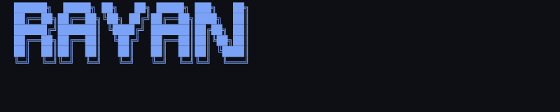
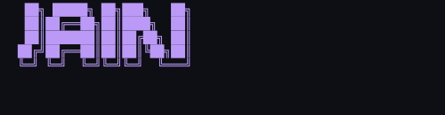

<!-- ASCII via patorjk rendered as SVG image — guaranteed to show -->
<div align="center">
  
</div>
<div align="center">
  
</div>

<!-- Animated subtitle -->
<div align="center">
  
</div>

<br/>

<!-- Badges row -->
<div align="center">
  <a href="https://github.com/rayanjainn?tab=followers">
    
  </a>
  &nbsp;
  <a href="https://github.com/rayanjainn?tab=repositories&sort=stargazers">
    
  </a>
  &nbsp;
  
  &nbsp;
  
</div>

<br/><br/>

---

## whoami

```fish
╭─ rayan@raycode
╰─❯ cat ./whoami.toml
```

```toml
[identity]
name        = "Rayan Jain"
handle      = "@rayanjainn"
location    = "Mumbai, Maharashtra, India"
website     = "app.raycode.tech"
email       = "rayansjain@gmail.com"

[engineering]
primary_lang  = "TypeScript"
focus         = [
  "Full Stack Web Development",
  "Collaborative Developer Tools",
  "Automation & Scraping Systems"
]

[mindset]
philosophy  = "Ship fast. Break things. Fix them faster."
status      = "always building something..."
open_to     = ["collabs", "OSS", "interesting problems"]
```

<br/>

---

## Stack

```fish
╭─ rayan@raycode  ~
╰─❯ ls ./stack --group-by=layer
```

<br/>

<table width="100%" align="center">
  <tr>
    <td align="center" width="120"><b>Languages</b></td>
    <td>
      
      
      
      
      
      
    </td>
  </tr>
  <tr>
    <td align="center"><b>Frontend</b></td>
    <td>
      
      
      
      
      
    </td>
  </tr>
  <tr>
    <td align="center"><b>Backend</b></td>
    <td>
      
      
      
    </td>
  </tr>
  <tr>
    <td align="center"><b>Databases</b></td>
    <td>
      
      
      
      
    </td>
  </tr>
  <tr>
    <td align="center"><b>DevOps</b></td>
    <td>
      
      
      
      
      
    </td>
  </tr>
</table>

<br/>

---

## GitHub Stats

```fish
╭─ rayan@raycode  ~
╰─❯ gh api /stats --pretty
```

<br/>

<table width="100%" align="center">
  <tr>
    <td width="55%" align="center">
      
    </td>
    <td width="45%" align="center">
      
    </td>
  </tr>
  <tr>
    <td colspan="2" align="center">
      
    </td>
  </tr>
</table>

<br/>

---

## Contribution Graph

```fish
╭─ rayan@raycode  ~
╰─❯ git log --graph --all --oneline
```

<br/>

<div align="center">
  
</div>

<br/>

---

## Coding Activity

```fish
╭─ rayan@raycode  ~
╰─❯ wakatime --report --week
```

<br/>

<!--START_SECTION:waka-->


**🐱 My GitHub Data** 

> 📦 142.0 kB Used in GitHub's Storage 
 > 
> 🏆 408 Contributions in the Year 2026
 > 
> 🚫 Not Opted to Hire
 > 
> 📜 40 Public Repositories 
 > 
> 🔑 15 Private Repositories 
 > 
**I'm an Early 🐤** 

```text
🌞 Morning                332 commits         ⣿⣿⣿⣿⣿⣿⣿⣿⣿⣀⣀⣀⣀⣀⣀⣀⣀⣀⣀⣀⣀⣀⣀⣀⣀   34.33 % 
🌆 Daytime                369 commits         ⣿⣿⣿⣿⣿⣿⣿⣿⣿⣿⣀⣀⣀⣀⣀⣀⣀⣀⣀⣀⣀⣀⣀⣀⣀   38.16 % 
🌃 Evening                170 commits         ⣿⣿⣿⣿⣀⣀⣀⣀⣀⣀⣀⣀⣀⣀⣀⣀⣀⣀⣀⣀⣀⣀⣀⣀⣀   17.58 % 
🌙 Night                  96 commits          ⣿⣿⣀⣀⣀⣀⣀⣀⣀⣀⣀⣀⣀⣀⣀⣀⣀⣀⣀⣀⣀⣀⣀⣀⣀   09.93 % 
```
📅 **I'm Most Productive on Sunday** 

```text
Monday                   73 commits          ⣿⣿⣀⣀⣀⣀⣀⣀⣀⣀⣀⣀⣀⣀⣀⣀⣀⣀⣀⣀⣀⣀⣀⣀⣀   07.55 % 
Tuesday                  79 commits          ⣿⣿⣀⣀⣀⣀⣀⣀⣀⣀⣀⣀⣀⣀⣀⣀⣀⣀⣀⣀⣀⣀⣀⣀⣀   08.17 % 
Wednesday                146 commits         ⣿⣿⣿⣿⣀⣀⣀⣀⣀⣀⣀⣀⣀⣀⣀⣀⣀⣀⣀⣀⣀⣀⣀⣀⣀   15.10 % 
Thursday                 82 commits          ⣿⣿⣀⣀⣀⣀⣀⣀⣀⣀⣀⣀⣀⣀⣀⣀⣀⣀⣀⣀⣀⣀⣀⣀⣀   08.48 % 
Friday                   55 commits          ⣿⣀⣀⣀⣀⣀⣀⣀⣀⣀⣀⣀⣀⣀⣀⣀⣀⣀⣀⣀⣀⣀⣀⣀⣀   05.69 % 
Saturday                 164 commits         ⣿⣿⣿⣿⣀⣀⣀⣀⣀⣀⣀⣀⣀⣀⣀⣀⣀⣀⣀⣀⣀⣀⣀⣀⣀   16.96 % 
Sunday                   368 commits         ⣿⣿⣿⣿⣿⣿⣿⣿⣿⣿⣀⣀⣀⣀⣀⣀⣀⣀⣀⣀⣀⣀⣀⣀⣀   38.06 % 
```


📊 **This Week I Spent My Time On** 

```text
💬 Programming Languages: 
TypeScript               2 hrs 24 mins       ⣿⣿⣿⣿⣿⣿⣿⣿⣿⣿⣀⣀⣀⣀⣀⣀⣀⣀⣀⣀⣀⣀⣀⣀⣀   38.40 % 
Markdown                 1 hr 36 mins        ⣿⣿⣿⣿⣿⣿⣀⣀⣀⣀⣀⣀⣀⣀⣀⣀⣀⣀⣀⣀⣀⣀⣀⣀⣀   25.58 % 
YAML                     45 mins             ⣿⣿⣿⣀⣀⣀⣀⣀⣀⣀⣀⣀⣀⣀⣀⣀⣀⣀⣀⣀⣀⣀⣀⣀⣀   11.99 % 
Other                    25 mins             ⣿⣿⣀⣀⣀⣀⣀⣀⣀⣀⣀⣀⣀⣀⣀⣀⣀⣀⣀⣀⣀⣀⣀⣀⣀   06.67 % 
JSON                     22 mins             ⣿⣀⣀⣀⣀⣀⣀⣀⣀⣀⣀⣀⣀⣀⣀⣀⣀⣀⣀⣀⣀⣀⣀⣀⣀   05.93 % 

🔥 Editors: 
Antigravity              4 hrs 8 mins        ⣿⣿⣿⣿⣿⣿⣿⣿⣿⣿⣿⣿⣿⣿⣿⣿⣀⣀⣀⣀⣀⣀⣀⣀⣀   65.81 % 
Claude Code              2 hrs 4 mins        ⣿⣿⣿⣿⣿⣿⣿⣿⣀⣀⣀⣀⣀⣀⣀⣀⣀⣀⣀⣀⣀⣀⣀⣀⣀   32.96 % 
VS Code                  4 mins              ⣀⣀⣀⣀⣀⣀⣀⣀⣀⣀⣀⣀⣀⣀⣀⣀⣀⣀⣀⣀⣀⣀⣀⣀⣀   01.24 % 

🐱‍💻 Projects: 
devhub                   5 hrs 30 mins       ⣿⣿⣿⣿⣿⣿⣿⣿⣿⣿⣿⣿⣿⣿⣿⣿⣿⣿⣿⣿⣿⣿⣀⣀⣀   87.64 % 
port                     32 mins             ⣿⣿⣀⣀⣀⣀⣀⣀⣀⣀⣀⣀⣀⣀⣀⣀⣀⣀⣀⣀⣀⣀⣀⣀⣀   08.55 % 
lazertracker             14 mins             ⣿⣀⣀⣀⣀⣀⣀⣀⣀⣀⣀⣀⣀⣀⣀⣀⣀⣀⣀⣀⣀⣀⣀⣀⣀   03.81 % 
```

**I Mostly Code in TypeScript** 

```text
TypeScript               35 repos            ⣿⣿⣿⣿⣿⣿⣿⣿⣿⣿⣿⣿⣿⣀⣀⣀⣀⣀⣀⣀⣀⣀⣀⣀⣀   52.24 % 
Python                   4 repos             ⣿⣀⣀⣀⣀⣀⣀⣀⣀⣀⣀⣀⣀⣀⣀⣀⣀⣀⣀⣀⣀⣀⣀⣀⣀   05.97 % 
Rust                     3 repos             ⣿⣀⣀⣀⣀⣀⣀⣀⣀⣀⣀⣀⣀⣀⣀⣀⣀⣀⣀⣀⣀⣀⣀⣀⣀   04.48 % 
Swift                    1 repo              ⣀⣀⣀⣀⣀⣀⣀⣀⣀⣀⣀⣀⣀⣀⣀⣀⣀⣀⣀⣀⣀⣀⣀⣀⣀   01.49 % 
Ruby                     1 repo              ⣀⣀⣀⣀⣀⣀⣀⣀⣀⣀⣀⣀⣀⣀⣀⣀⣀⣀⣀⣀⣀⣀⣀⣀⣀   01.49 % 
```


<!--END_SECTION:waka-->

<br/>

---

## Featured Projects

```fish
╭─ rayan@raycode  ~/projects
╰─❯ ls --pinned --sort=stars
```

<br/>

<table width="100%" align="center">
  <tr>
    <td width="50%" align="center">
      <a href="https://github.com/rayanjainn/draw-app">
        
      </a>
    </td>
    <td width="50%" align="center">
      <a href="https://github.com/rayanjainn/multiverse">
        
      </a>
    </td>
  </tr>
  <tr>
    <td width="50%" align="center">
      <a href="https://github.com/rayanjainn/boomsuite">
        
      </a>
    </td>
    <td width="50%" align="center">
      <a href="https://github.com/rayanjainn/chess">
        
      </a>
    </td>
  </tr>
  <tr>
    <td width="50%" align="center">
      <a href="https://github.com/rayanjainn/scrapeit">
        
      </a>
    </td>
    <td width="50%" align="center">
      <a href="https://github.com/Th3C0d3Mast3r/Network-Analyzer-and-Healer">
        
      </a>
    </td>
  </tr>
</table>

<br/>

---

## Trophies

```fish
╭─ rayan@raycode  ~
╰─❯ gh trophies --theme=tokyonight
```

<br/>

<div align="center">
  
</div>

<br/>

---

## Contribution Snake

<br/>

<div align="center">
  <picture>
    <source media="(prefers-color-scheme: dark)" srcset="https://raw.githubusercontent.com/rayanjainn/rayanjainn/output/github-contribution-grid-snake-dark.svg" />
    <source media="(prefers-color-scheme: light)" srcset="https://raw.githubusercontent.com/rayanjainn/rayanjainn/output/github-contribution-grid-snake.svg" />
    
  </picture>
</div>

<br/>

---

## Connect

```fish
╭─ rayan@raycode  ~
╰─❯ cat ./links.md
```

<br/>

<div align="center">
  <a href="https://github.com/rayanjainn">
    
  </a>
  &nbsp;
  <a href="https://linkedin.com/in/rayanjainn">
    
  </a>
  &nbsp;
  <a href="https://twitter.com/rayanjainn">
    
  </a>
  &nbsp;
  <a href="mailto:rayansjain@gmail.com">
    
  </a>
  &nbsp;
  <a href="https://app.raycode.tech">
    
  </a>
</div>

<br/>

<div align="center">
  
</div>

<br/>
