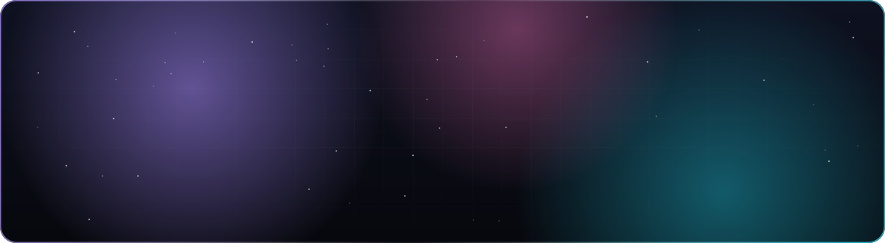
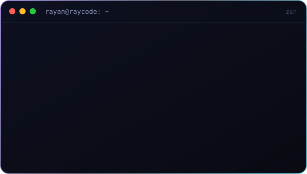
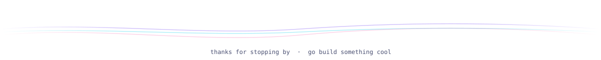

 

  

 

<h3 align="center">⟡ featured work ⟡</h3>

 

<h3 align="center">⟡ toolbox ⟡</h3>

  
  

 

  <picture>
    <source media="(prefers-color-scheme: dark)" srcset="https://raw.githubusercontent.com/rayanjainn/rayanjainn/output/snake-dark.svg" />
    <source media="(prefers-color-scheme: light)" srcset="https://raw.githubusercontent.com/rayanjainn/rayanjainn/output/snake-light.svg" />
    
  </picture>

  

